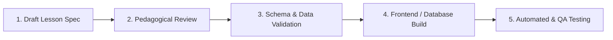

# UKC Learning App - Content & Lesson Documentation Hub

Welcome to the **UKC Learning App Content & Lesson Documentation Hub**. 

This folder serves as the single source of truth for all curriculum designs, lesson content specs, vocabulary databases, grammar rules, interactive exercise plans, and assessment quizzes **before** any lesson is built into frontend components or seeded into the database.

---

## 🎯 Purpose & Workflow

To ensure high pedagogical quality, consistent data schemas, and smooth frontend development, all lessons must pass through the content design phase before engineering.



1. **Draft Lesson Spec**: Authors create a spec in `docs/lessons/` using [`docs/templates/lesson-template.md`](file:///home/tamy/p/ukc-learning-app/docs/templates/lesson-template.md).
2. **Pedagogical & Content Review**: Ensure vocabulary, romanization, audio keys, and grammar explanations are accurate.
3. **Data Schema Validation**: Verify that the JSON payload at the bottom of the lesson doc matches the application data schema (`src/services/supabaseClient.js` or API schemas).
4. **Build & Integration**: Developers build interactive components or connect data state.
5. **QA & Verification**: Verify UI render and component unit tests pass.

---

## 📁 Directory Structure

```
docs/
├── README.md                      # Content documentation overview (this file)
├── guidelines/
│   └── content-style-guide.md     # Romanization standards, audio rules, tone guidelines
├── templates/
│   ├── lesson-template.md         # Standard spec template for lessons & flashcard decks
│   └── quiz-template.md           # Standard spec template for unit quizzes & assessments
├── curriculum/
│   └── roadmap.md                 # Overall curriculum structure, units, and learning nodes
└── lessons/
    └── unit-01-foundations/       # Unit 1 Content Specifications
        ├── lesson-00-hangul-basics.md
        ├── lesson-01-greetings.md
        ├── lesson-02-essential-vocab.md
        ├── lesson-03-school-education.md
        └── unit-01-quiz.md
```

---

## 📋 Quick Links

- 📐 **Lesson Spec Template**: [`docs/templates/lesson-template.md`](file:///home/tamy/p/ukc-learning-app/docs/templates/lesson-template.md)
- 📝 **Quiz Spec Template**: [`docs/templates/quiz-template.md`](file:///home/tamy/p/ukc-learning-app/docs/templates/quiz-template.md)
- 🗺️ **Curriculum Roadmap**: [`docs/curriculum/roadmap.md`](file:///home/tamy/p/ukc-learning-app/docs/curriculum/roadmap.md)
- 🔒 **Auth & Security Rules**: [`docs/guidelines/auth-rules.md`](file:///home/tamy/p/ukc-learning-app/docs/guidelines/auth-rules.md)
- ✍️ **Content Style Guide**: [`docs/guidelines/content-style-guide.md`](file:///home/tamy/p/ukc-learning-app/docs/guidelines/content-style-guide.md)

---

## ⚙️ Schema Standard for Content Data

All lessons documented in this folder should provide a JSON export section formatted for immediate inclusion in frontend mock arrays or database seeds:

```json
{
  "id": "les-u1-02",
  "title": "Essential Vocabulary",
  "unit": 1,
  "type": "vocab_flashcard",
  "items": [
    {
      "id": "fc-1",
      "korean": "안녕하세요",
      "romanization": "An-nyeong-ha-se-yo",
      "english": "Hello / Good day (Formal)",
      "category": "Greetings",
      "exampleSentence": "안녕하세요! 만나서 반갑습니다.",
      "exampleTranslation": "Hello! Nice to meet you."
    }
  ]
}
```
