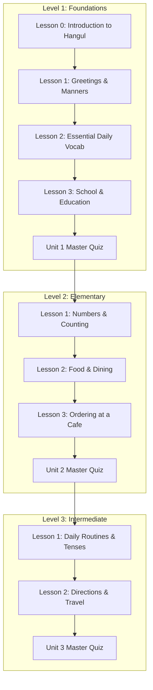

# UKC Curriculum Roadmap & Learning Pathways

This document outlines the structured learning units, modules, and progression nodes planned for the UKC Learning App.

---

## 🗺️ Curriculum Overview

---

## 📌 Unit Breakdown

### Level 1: Korean Foundations

#### Unit 1: Essential Greetings & Core Vocabulary
- **Lesson 0**: Introduction to Hangul Reading (`les-u1-00`) - *Status: Documented (Ready for Build)*
- **Lesson 1**: Greetings & Manners (`les-u1-01`) - *Status: Documented & Implemented*
- **Lesson 2**: Essential Daily Vocabulary (`les-u1-02`) - *Status: Documented & Implemented*
- **Lesson 3**: School & Education Words (`les-u1-03`) - *Status: Documented (Ready for Build)*
- **Assessment**: Unit 1 Master Quiz (`quiz-u1`) - *Status: Documented (Ready for Build)*

#### Unit 2: Social Interactions & Culture
- **Lesson 1**: Introducing Yourself & Expressions (`les-u2-01`) - *Status: Planned*
- **Lesson 2**: Asking Questions (`les-u2-02`) - *Status: Planned*
- **Assessment**: Unit 2 Master Quiz (`quiz-u2`) - *Status: Planned*

---

## 📊 Node Progression Rules

1. **Sequential Unlock**: A student must complete preceding lessons before unlocking the next node.
2. **Mastery Threshold**: Unit Quizzes require a score of **80% or higher** to unlock the subsequent level.
3. **Streak Multiplier**: Daily logins maintain the user's active streak widget.
