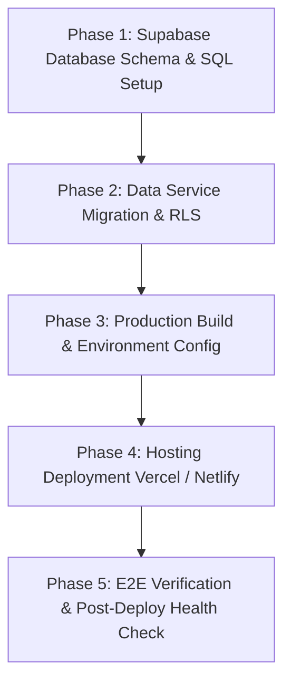

# MVP Deployment & Database Migration Gameplan

This document outlines the step-by-step gameplan for migrating data from `localStorage` to Supabase Postgres DB, deploying the UKC Learning App MVP to production, and validating system health.

---

## 📅 Roadmap Overview



---

## 🗄️ Phase 1: Database Migration & Schema Setup (Supabase / Postgres)

### 1.1 Tables & Schema SQL Script
Execute the following SQL in the Supabase SQL Editor:

```sql
-- 1. Enable UUID Extension
CREATE EXTENSION IF NOT EXISTS "uuid-ossp";

-- 2. Users Table
CREATE TABLE IF NOT EXISTS public.users (
    id TEXT PRIMARY KEY DEFAULT uuid_generate_v4()::text,
    email TEXT UNIQUE NOT NULL,
    name TEXT NOT NULL,
    role TEXT NOT NULL CHECK (role IN ('Student', 'Admin')),
    is_online BOOLEAN DEFAULT false,
    active_session_id TEXT,
    created_at TIMESTAMPTZ DEFAULT NOW()
);

-- 3. Lessons Table
CREATE TABLE IF NOT EXISTS public.lessons (
    id TEXT PRIMARY KEY,
    order_index INT NOT NULL,
    unit TEXT NOT NULL,
    title TEXT NOT NULL,
    description TEXT,
    type TEXT NOT NULL CHECK (type IN ('vocab', 'vocab quiz', 'custom')),
    paired_vocab_id TEXT,
    paired_quiz_id TEXT,
    status TEXT NOT NULL DEFAULT 'Active' CHECK (status IN ('Active', 'Draft')),
    words JSONB DEFAULT '[]'::jsonb,
    created_at TIMESTAMPTZ DEFAULT NOW()
);

-- 4. Student Lesson Access (Batch assignment)
CREATE TABLE IF NOT EXISTS public.student_lesson_access (
    id TEXT PRIMARY KEY DEFAULT uuid_generate_v4()::text,
    student_id TEXT NOT NULL REFERENCES public.users(id) ON DELETE CASCADE,
    lesson_id TEXT NOT NULL REFERENCES public.lessons(id) ON DELETE CASCADE,
    assigned_at TIMESTAMPTZ DEFAULT NOW(),
    UNIQUE(student_id, lesson_id)
);

-- 5. Student Lesson Progress
CREATE TABLE IF NOT EXISTS public.student_lesson_progress (
    id TEXT PRIMARY KEY DEFAULT uuid_generate_v4()::text,
    student_id TEXT NOT NULL REFERENCES public.users(id) ON DELETE CASCADE,
    lesson_id TEXT NOT NULL REFERENCES public.lessons(id) ON DELETE CASCADE,
    completed_at TIMESTAMPTZ DEFAULT NOW(),
    score INT DEFAULT 0,
    UNIQUE(student_id, lesson_id)
);
```

### 1.2 Row Level Security (RLS) Policies
```sql
ALTER TABLE public.users ENABLE ROW LEVEL SECURITY;
ALTER TABLE public.lessons ENABLE ROW LEVEL SECURITY;
ALTER TABLE public.student_lesson_access ENABLE ROW LEVEL SECURITY;
ALTER TABLE public.student_lesson_progress ENABLE ROW LEVEL SECURITY;

-- Allow public read/write for authenticated app users (or fine-tune per role)
CREATE POLICY "Allow public read access to lessons" ON public.lessons FOR SELECT USING (true);
CREATE POLICY "Allow authenticated access to users" ON public.users FOR ALL USING (true);
CREATE POLICY "Allow authenticated access to access" ON public.student_lesson_access FOR ALL USING (true);
CREATE POLICY "Allow authenticated access to progress" ON public.student_lesson_progress FOR ALL USING (true);
```

---

## 🔄 Phase 2: Application Data Layer Integration

1. Update `src/services/supabaseClient.js` to query Supabase DB tables (`users`, `lessons`, `student_lesson_progress`) when `VITE_SUPABASE_URL` is set, falling back to `localStorage` when offline.
2. Update `src/services/lessonRegistry.js` to fetch and sync dynamic lessons from `lessons` table.
3. Ensure single session check heartbeat syncs with `active_session_id` in `public.users`.

---

## ⚙️ Phase 3: Production Build & Environment Setup

### 3.1 Environment Variables
Create `.env.production` in project root:

```env
VITE_SUPABASE_URL=https://<your-supabase-project-id>.supabase.co
VITE_SUPABASE_ANON_KEY=<your-supabase-anon-key>
```

### 3.2 Automated Verification Commands
Run pre-deployment builds & tests:

```bash
# 1. Run unit test suite
npx vitest run

# 2. Build production bundle
npm run build
```

---

## 🚀 Phase 4: Hosting Deployment (Vercel / Netlify)

### 4.1 Deployment Setup (Vercel Example)
1. Push repository code to GitHub.
2. Import repository into Vercel / Netlify.
3. Set Framework Preset: **Vite**.
4. Configure Environment Variables (`VITE_SUPABASE_URL`, `VITE_SUPABASE_ANON_KEY`).
5. Ensure SPA Rewrite routing rule is configured in `vercel.json`:

```json
{
  "rewrites": [
    { "source": "/(.*)", "destination": "/index.html" }
  ]
}
```

---

## 🎯 Phase 5: Verification & Post-Deployment Checklist

- [ ] **Auth Check**: Test Admin & Student logins on live production URL.
- [ ] **Lesson Pathway Check**: Verify lessons display correctly with illustrations (`public/illustrations/*.svg`).
- [ ] **Quiz Check**: Verify 10-question randomized quizzes generate correctly with illustration multiple-choice options.
- [ ] **Hash Routing Check**: Test refreshing on a lesson page (`#lesson/les-vocab-practice-1`) and pressing browser Back button.
- [ ] **Batch Admin Control**: Test batch assignment modal ("Select All" / "Deselect All") in User Management.
